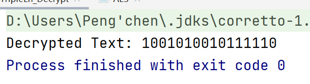

# 信息安全导论 AES加密解密算法

这是一个包含加密和解密功能以及简单图形界面的DES加密实现，明文和密文和密钥均为16位二进制数字或2字节字符。

### 运行环境
Java-version: JDK 1.8.0_362

编译器：IntelliJ IDEA 2021.1.1 (Ultimate Edition)

### 运行方法
1. 使用IDEA打开项目，等待项目加载完成

2. 找到`src`目录下的`AESEncryption.java`文件，右键点击`Run AESEncryption.main()`，等待编译完成

3. 在弹出的窗口中输入明文或密钥选项，点击`Encrypt` `Decrypt`按钮，即可在弹出的窗口中看到加密/解密后的结果

### 算法实现
算法原理在要求文档中已经非常详细，在此不做赘述

### 关卡测试

#### 关卡一 基本测试

要求：根据S-AES算法编写和调试程序，提供GUI解密支持用户交互。输入可以是16bit的数据和16bit的密钥，输出是16bit的密文。

本项目采用Java Awt和Swing编写GUI，运行界面如下


在输入框输入对应的名密文和密钥，并且使用按钮加密或解密，即可得到Result

**加密：**


**解密：**


#### 关卡二 交叉测试

要求：考虑到是"**算法标准"**，所有人在编写程序的时候需要使用相同算法流程和转换单元(替换盒、列混淆矩阵等)，以保证算法和程序在异构的系统或平台上都可以正常运行。设有A和B两组位同学(选择相同的密钥K)；则A、B组同学编写的程序对明文P进行加密得到相同的密文C；或者B组同学接收到A组程序加密的密文C，使用B组程序进行解密可得到与A相同的P。

从贺袁鑫同学的小组获取明文1111111111111111、密钥0000000000000000，然后由我的项目进行解密，获取到的明文与该小组加密之前的明文相同。多次换取数据尝试后，依旧能匹配，说明交叉测试成功


#### 关卡三 扩展功能

要求： 考虑到向实用性扩展，加密算法的数据输入可以是ASII编码字符串(分组为2 Bytes)，对应地输出也可以是ACII字符串(很可能是乱码)。


首先检查输入是否合法，在AESUtils中编写相关检查看书，检测是否输入合法

~~~java
/**
     * 判断输入是否合法
     * @param input
     * @return
     */
    public static boolean isLegalInput(String input) {
        boolean flag = false;
        if(input.matches("[01]{16}")) {
            flag = true;
        }

        if(input.length() == 2 && (int) input.charAt(0) >= 0 && (int) input.charAt(0) <= 127 &&
        (int) input.charAt(1) >= 0 && (int) input.charAt(1) <= 127){
            flag = true;
        }

        return flag;

    }
~~~


==如果输入不合法，则会有以下提示信息==


将输入的字符先转换为相应的ASCII码，然后再将其转换为二进制格式，最后应用于加密和解密操作。同样地，也可以将加密和解密后的结果转换为字符形式并输出。示例如下：


#### 关卡四 多重加密

##### 3.4.1 双重加密

要求：将S-AES算法通过双重加密进行扩展，分组长度仍然是16 bits，但密钥长度为32 bits。

双重加解密实现代码如下：

```java
   /**
     * 双重加密
     * @param ciphertext
     * @param key
     * @return
     */
    public static int[] doubleEncrypt(int[] ciphertext, int[] key) {
        int[] K2 = new int[16];
        int[] K1 = new int[16];

        // 从密钥数组中提取 K1
        for (int i = 0; i < 16; i++) {
            K1[i] = key[i];
        }

        // 从密钥数组中提取 K2
        for (int i = 16; i < 32; i++) {
            K2[i - 16] = key[i];
        }

        int[] firstDecryption = decrypt(ciphertext, K1);
        // 第二次加密
        int[] plaintext = decrypt(firstDecryption, K2);

        return plaintext;
    }


    /**
     * 双重解密
     * @param ciphertext
     * @param key
     * @return
     */
    public static int[] doubleDecrypt(int[] ciphertext, int[] key) {
        int[] K2 = new int[16];
        int[] K1 = new int[16];

        // 从密钥数组中提取 K1
        for (int i = 0; i < 16; i++) {
            K1[i] = key[i];
        }

        for (int i = 16; i < 32; i++) {
            K2[i - 16] = key[i];
        }

        int[] firstDecryption = decrypt(ciphertext, K1);
        int[] plaintext = decrypt(firstDecryption, K2);

        return plaintext;
    }

```


##### 3.4.2 中间相遇攻击

要求：假设你找到了使用相同密钥的明、密文对(一个或多个)，请尝试使用中间相遇攻击的方法找到正确的密钥Key(K1+K2)。

- 中间相遇攻击（Meet-in-the-Middle Attack）是一种密码学攻击方式，通常用于破解使用可逆加密算法的系统。这种攻击方式充分利用了密码算法的可逆性和其输入输出空间的大小，通过两次计算来查找符合特定条件的密钥或明文。

中间相遇攻击（Meet-in-the-Middle Attack）通常涉及以下步骤：

1. 收集明文-密文对：攻击者需要获取一组已知的明文和对应的密文。这些明文-密文对可以通过被攻击系统的通信或其他渠道获取。这些对被用于后续的攻击。
2. 选择可能的密钥值：攻击者选择一个可能的密钥值K1，并使用它来对明文进行加密。这将产生一组中间结果（Intermediate Values），通常用中间值M1表示。
3. 选择另一个密钥值：攻击者选择另一个可能的密钥值K2，并使用它来对密文进行解密。这将产生另一组中间结果，通常用中间值C2表示。
4. 构建中间值表：攻击者将中间值M1和中间值C2存储在一个表格或数据结构中，通常称为中间值表。这个表格将用于后续的比较。
5. 比较中间值：攻击者遍历中间值表，尝试寻找匹配的中间值对(M1, C2)。如果找到匹配的中间值对，那么攻击者可以确定K1和K2可能是正确的密钥对。
6. 解密明文：一旦找到匹配的密钥对(K1, K2)，攻击者可以使用它们来解密其他密文，以获得明文。


代码实现如下：

```java
public class MeetInTheMiddleAttack {

    public static int[] findKey(int[] plaintext1, int[] ciphertext1, int[] plaintext2, int[] ciphertext2) {
        // 遍历所有可能的密钥
        for (int key = 0; key < 65536; key++) {
            int[] keyBinary = new int[16];
            String binaryString = Integer.toBinaryString(key);
            binaryString = String.format("%16s", binaryString).replace(' ', '0'); // 将密钥转换为16位二进制表示

            for (int i = 0; i < 16; i++) {
                keyBinary[i] = Integer.parseInt(String.valueOf(binaryString.charAt(i)));
            }

            // 加密明文1和明文2，获取中间计算结果
            int[] intermediateResults1 = getIntermediateResults(plaintext1, keyBinary);
            int[] intermediateResults2 = getIntermediateResults(plaintext2, keyBinary);

            // 判断中间计算结果是否相等
            if (Arrays.equals(intermediateResults1, intermediateResults2)) {
                // 对两个轮密钥的异或结果进行异或运算，得到正确的密钥
                int[] correctKey = AESUtils.xor(intermediateResults1, intermediateResults2);
                return correctKey;
            }
        }
        return null;
    }

    // 假设存在一个 getIntermediateResults 方法用于获取中间计算结果
    public static int[] getIntermediateResults(int[] plaintext, int[] key) {
        // 实现获取中间计算结果的逻辑
        // 这里只是一个占位符，你需要替换成你的实际逻辑
        return new int[16];
    }


    public static void main(String[] args) {
        int[] key1 = {1,1,1,1,1,1,1,1,1,1,1,1,1,1,1,1};
        int[] plaintext1 = {1,1,1,1,1,1,1,1,1,1,1,1,1,1,1,1};
        int[] ciphertext1 = AES.encrypt(plaintext1, key1);

        int[] plaintext2 = {0,0,0,0,0,0,0,0,0,0,0,0,0,0,0,0};
        int[] ciphertext2 = AES.encrypt(plaintext2, key1);

        int[] key = findKey(plaintext1, ciphertext1, plaintext2, ciphertext2);

        System.out.print("Correct key: ");
        for (int bit : key) {
            System.out.print(bit);
        }
    }
}
```

输出结果如下：


##### 3.4.3 三重加密

要求：将S-AES算法通过三重加密进行扩展，下面两种模式选择一种完成：(1)按照32 bits密钥Key(K1+K2)的模式进行三重加密解密，(2)使用48bits(K1+K2+K3)的模式进行三重加解密。

- 选取（2）
- 采用48bit密钥进行三重加密，则相当于使用K1、K2、K3各加密一次，经过三重加密获得明文，而密文则过程相反，简单的示例代码如下

```java
    public static int[] tripleEncrypt(int[] ciphertext, int[] key){
        int[] K1 = Arrays.copyOfRange(key, 0, 16);
        int[] K2 = Arrays.copyOfRange(key, 16, 32);
        int[] K3 = Arrays.copyOfRange(key, 32, key.length);


        int[] firstEncryption = AES.encrypt(ciphertext, K3);

        int[] secondEncryption = AES.encrypt(firstEncryption, K2);

        int[] plaintext = AES.encrypt(secondEncryption, K1);

        return plaintext;
    }


    public static int[] tripleDecrypt(int[] ciphertext, int[] key){
        int[] K1 = Arrays.copyOfRange(key, 0, 16);
        int[] K2 = Arrays.copyOfRange(key, 16, 32);
        int[] K3 = Arrays.copyOfRange(key, 32, key.length);

        // 调用 decrypt 方法执行第一次解密
        int[] firstDecryption = AES.decrypt(ciphertext, K3);

        // 调用 decrypt 方法执行第二次解密，使用K2作为密钥
        int[] secondDecryption = AES.decrypt(firstDecryption, K2);

        // 调用 decrypt 方法执行第三次解密，使用K1作为密钥
        int[] plaintext = AES.decrypt(secondDecryption, K1);

        return plaintext;
    }
```


此处不再实现图形化界面，结果展示如下：




#### 关卡五 工作模式

要求：基于S-AES算法，使用密码分组链(CBC)模式对较长的明文消息进行加密。注意初始向量(16 bits) 的生成，并需要加解密双方共享。在CBC模式下进行加密，并尝试对密文分组进行替换或修改，然后进行解密，请对比篡改密文前后的解密结果。

- CBC（Cipher Block Chaining）是一种常见的块密码加密模式，用于将明文分成固定大小的块，并依次对每个块进行加密，使用前一个块的密文与当前块的明文进行异或运算。CBC模式提供了一些重要的安全性特性，例如抵抗明文和密文的修改，以及不同的明文块不会产生相同的密文块。


CBC的加解密代码实现如下

```java
    public static int[] cbcEncrypt(int[] plaintext, int[] iv, int[] key) {
        int[] ciphertext = new int[plaintext.length];

        int[] ivTemp = Arrays.copyOf(iv, iv.length); // 用于保存前一个块的密文

        int blockSize = iv.length; // 块的大小

        for (int i = 0; i < plaintext.length; i += blockSize) {
            int[] block = Arrays.copyOfRange(plaintext, i, i + blockSize); // 获取当前块

            // 与前一个块的密文进行异或运算
            int[] K = AESUtils.xor(block, ivTemp);

            // 使用密钥加密当前块
            int[] encryptedBlock = AES.encrypt(K, key);

            // 将加密后的块作为密文
            System.arraycopy(encryptedBlock, 0, ciphertext, i, blockSize);

            // 更新前一个块的密文为当前块的密文
            ivTemp = Arrays.copyOf(encryptedBlock, blockSize);
        }

        return ciphertext;

    }

    public static int[] cbcDecrypt(int[] ciphertext, int[] iv, int[] key) {
        int[] plaintext = new int[ciphertext.length];

        int[] ivTemp = Arrays.copyOf(iv, iv.length); // 用于保存前一个块的密文

        int blockSize = iv.length; // 块的大小

        for (int i = 0; i < ciphertext.length; i += blockSize) {
            int[] block = Arrays.copyOfRange(ciphertext, i, i + blockSize); // 获取当前块

            // 使用密钥解密当前块
            int[] decryptedBlock = AES.decrypt(block, key);

            // 与前一个块的密文进行异或运算
            int[] plaintextBlock = AESUtils.xor(decryptedBlock, ivTemp);

            // 将解密后的块作为明文
            System.arraycopy(plaintextBlock, 0, plaintext, i, blockSize);

            // 更新前一个块的密文为当前块
            ivTemp = Arrays.copyOf(block, blockSize);
        }

        return plaintext;

    }
```

结果如下图所示：


由结果，可以进行正常的加解密过程
